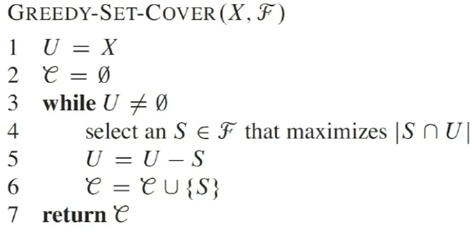
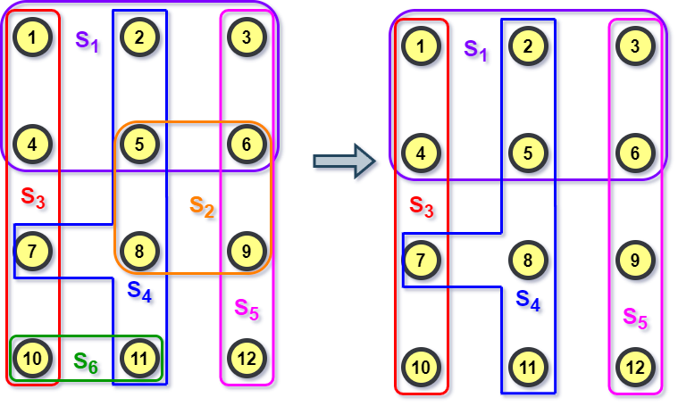
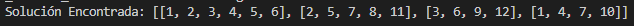
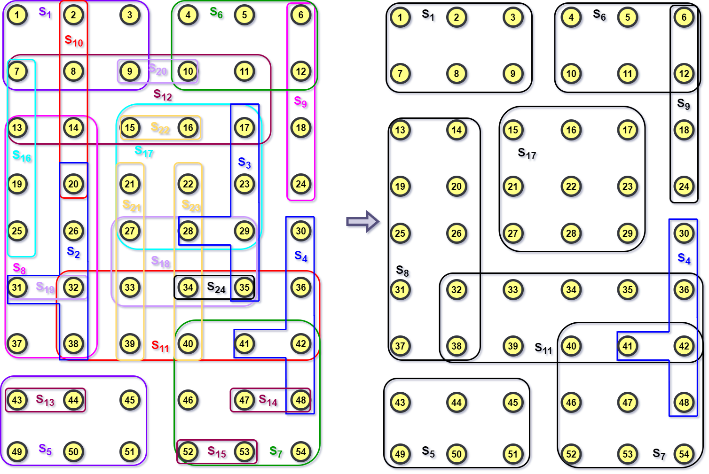
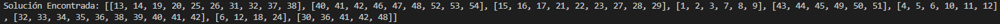
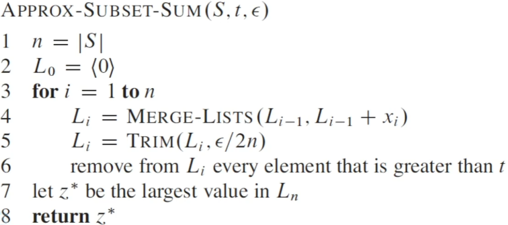
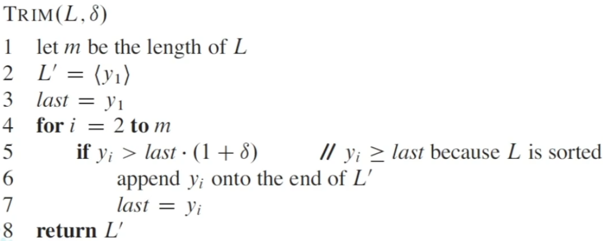

# Tarea de Programación 2

### Armando Abraham Aquino Chapa

- Número de cuenta: `317058163`
- [Tarea de Programación 2][liga-tarea-2]

### Instrucciones:

* La práctica fue elaborada utilizando `Java`

* Para ejecutar los algoritmos posicionarse dentro de la carpeta `src` y ejecutar en la terminal los siguientes comandos:

   - Problema Set Covering:
      ```bash
      javac SetCovering.java
      java main
      ```

   - Problema Subset Sum:
      ```bash
      javac SubsetSum.java
      java main
      ```

### Observaciones:


* Problema SetCovering:
   - El archivo `SetCovering.java` representa nuestra clase principal y la entrada de nuestro algoritmo (el conjunto X y la familia de subconjuntos F) se proporciona en la línea **17**(por si se quieren poner nuevos parámetros) mediante un `archivo.txt`. 

   - El archivo de texto debe ser de la siguiente forma:
      
       ```bash
       0,1,2,3, ...               El conjunto X representado por números enteros separados por una coma
       1,2                        A partir de la segunda linea se especifican la familia F dónde cada subconjunto 
       3,4                        está separado por un salto de línea  
       .
       .
       .
       ```

* Problema Subset Sum:
   
   - El archivo `SubsetSum.java` representa nuestra clase principal y la entrada de nuestro algoritmo (la lista S, el objetivo t y el factor de poda epsilon) se proporcionan en la línea **17**(por si se quieren poner nuevos parámetros) mediante un `archivo.txt`

   - El archivo de texto debe ser de la siguiente forma:
      
       ```bash
       0.3                        El factor de poda epsilon con 0 < epsilon < 1
       303                        El objetivo t
       103,104,101,106            La lista S dónde cada elemento es un número entero y se separa por una coma
       ```
      

## Problema SET COVERING:

Se implementó el siguiente algoritmo de aproximación (visto en clase):



Además se proporcionan dos ejemplos:

 - El primero se encuentra en el archivo `SetCoveringEjemploLibro.txt`. Y gráficamenta se ve de la siguiente forma:
    
   

   Produce la siguiente salida:

   

- El segundo se encuentra en el archivo `SetCoveringEjemploGrande.txt`. Y gráficamenta se ve de la siguiente forma:

  

  Produce la siguiente salida:

  

## Problema SUBSET SUM:

Se implementó el siguiente algoritmo de aproximación (visto en clase):





Además se proporcionan dos ejemplos:

 - El primero se encuentra en el archivo `SubsetSumEjemploLibro.txt` que produce la salida: **302**

- El segundo se encuentra en el archivo `SubsetSumEjemploGrande.txt` que produce la salida **2993**

[liga-tarea-2]: https://drive.google.com/file/d/1b9_1cwqopOGlH8LVBeD687JaxO4KWmTc/view