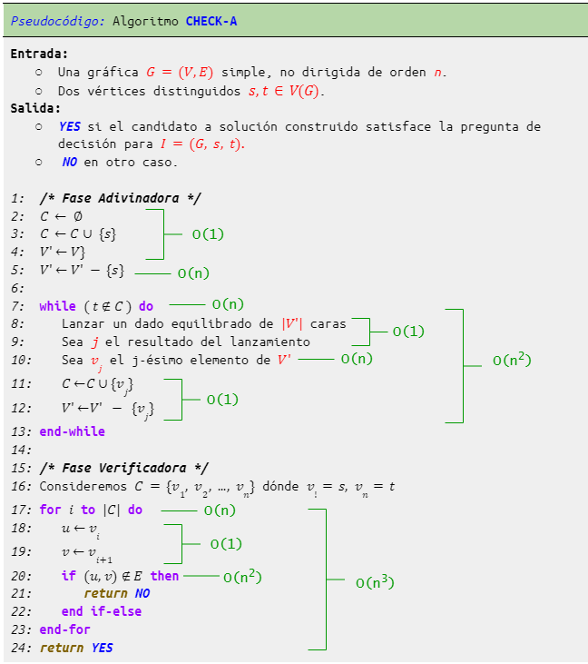
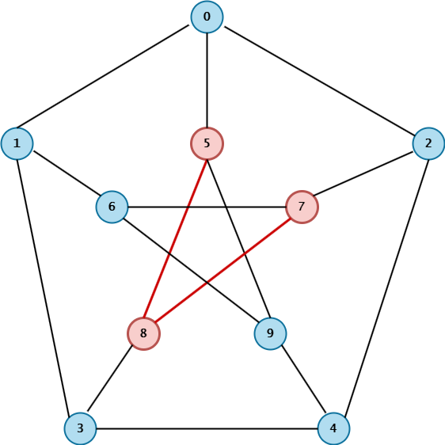
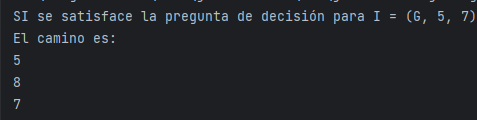
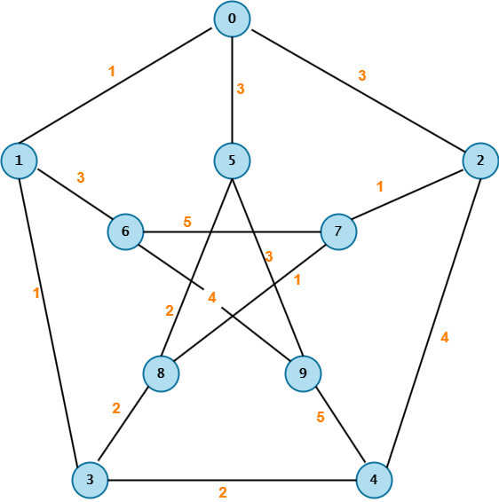
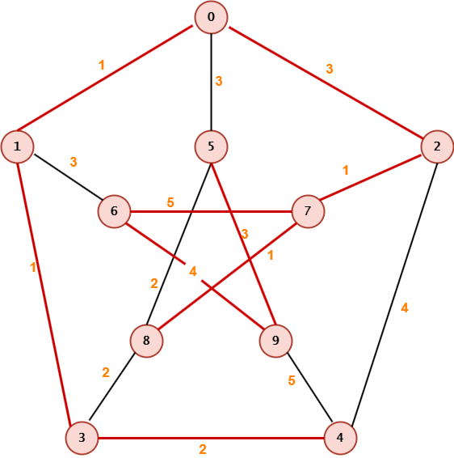

# Tarea de Programación 1

### Armando Abraham Aquino Chapa

- Número de cuenta: `317058163`
- [Tarea de Programación 1][liga-tarea-1]

### Instrucciones:

* La práctica fue elaborada utilizando `Java`

* Para ejecutar los algoritmos posicionarse dentro de la carpeta `src` y ejecutar en la terminal los siguientes comandos:

   - Problema de Alcanzabilidad:
      ```bash
      javac CheckA.java
      java CheckA
      ```

   - Árbol Generador de Peso Mínimo:
      ```bash
      javac CheckMST.java
      java CheckMST
      ```

### Observaciones:

* La modelación de las gráficas se encuentra en el archivo `Grafica.java`

* Problema de Alcanzabilidad:
   - El archivo `CheckA.java` representa nuestra clase principal y la entrada de nuestro algoritmo (la gráfica y la cota) se proporciona en la línea **68**(por si se quiere dar otra gráfica a la del ejemplo) mediante un `archivo.txt`. Cabe mencionar que en este caso si se permiten gráficas que no sean conexas.

   - El archivo de texto debe ser de la siguiente forma:
      
       ```bash
       0, 1, 2, 3                 Los vértices de nuestra gráfica que son números naturales consecutivos separados por coma y espacio
       1                          El vértice s 
       3                          El vértice t que sería el vértice final en el camino
       0, 1                       Los extremos de las aristas 
       1, 2
       2, 3
       .
       .
       .
       ```

* Árbol Generador de Peso Mínimo:
   
   - El archivo `CheckMST.java` representa nuestra clase principal y la entrada de nuestro algoritmo (la gráfica y la cota) se proporciona en la línea **52**(por si se quiere dar otra gráfica a la del ejemplo) mediante un `archivo.txt`

   - El archivo de texto debe ser de la siguiente forma:
      
       ```bash
       10                         La cota B del algoritmo que es un entero positvo
       0, 1, 2, 3, 4              Los vértices de nuestra gráfica que son números naturales consecutivos separados por coma y espacio
       0, 1, 10                   Los extremos de las aristas y su peso separados por una coma y un espcaio
       1, 2, 5
       .
       .
       .
       .
       ```
      

## Problema de Alcanzabilidad:

Se diseñó e implementó el siguiente algoritmo:



El algoritmo en la **Fase Adivinadora** que se encarga de construir un posible camino que no repita vertices en *G* comenzando por el vértice distinguido *s* y después sobre el restp de vértices en *V*. Este camino lo creamos agregando vértices con la **nd-choice** y paramos cuando nos encontremos con el vértice *t*, por lo que se asegura que no habrá vértices repetidos (ya que operamos sobre V). 

En la **Fase  Verificadora** verificamos que cada par de vértices consecutivos en C sea una arista, ya que en la fase adivinadora, escogemos los vértices "aleatoriamente", por lo que es posible que ese para de vértices consecutivos conformen una arista.

Cómo se aprecia en la imagen, la complejidad del algoritmo es cúbica ya que en la línea *7* operamos sobre C que es un conjunto que contiene vértices, y en la línea 9 de igual forma operamos sobre un conjunto de vértices. Análogamente ocurre lo mismo en la línea *17*, y en la línea *20* operamos sobre las aristas.

La implementación en `Java` la hacemos con *ArrayList* en vez de utilizar conjuntos cómo se aprecia en el algoritmo. La *nd-choice* la representamos utilizando **Random**. La fase adivinadora es igual a la del pseudocódigo, mientras que en la verificadora sólo agregamos unas comparaciones que no afectan la complejidad del algoritmo (ignorando clases externas al algoritmo cómo la que se encarga de modelar las gráficas o el método main que se encarga de leer nuestro *archivo.txt*). 

Un ejemplo de ejecución es si ejecutamos el programa con la gráfica que se representa en el archivo `Grafica1A.txt`, que representa la gráfica de **Petersen**:

 

 Obtenemos la salida:

 

## Árbol Generador de Peso Mínimo:

Se diseñó e implementó el siguiente algoritmo:


El algoritmo en la **Fase Adivinadora** se encarga de contstruir un árbol a partir de *G* con el hecho de qué como *G* es conexa, entonces si nuestro árbol posee *n-1* aristas nos va a asegurar que efectivamente es un árbol. Utilizamos la *nd-choice* cómo un 
dado con el mismo número de caras que de aristas de *G*, también vamos añadiendo las  *j-ésimas* aristas a nuestro árbol y obteniendo sus respectivos pesos. En la **Fase Verificadora** sólo calculamos si la cota de los pesos de las aristas de nuestro árbol es correcta.

Cómo se aprecia en la imagen, la complejidad del algoritmo es polinomial ya que en el **while** sólo operamos sobre el orden de la gráfica (número de vértices). Y dentro del **while** en la línea *9*, podemos ver que toma tiempo cuadrático ya que estamos buscando  la *j-ésima* arista qué en el peor de los casos es la última en nuestro conjunto **E**

La implementación en `Java` la hacemos con *Listas* en vez de utilizar conjuntos. La *nd-choice* la hacemos utilizando **Random**. Lo demás es prácticamente análogo al algoritmo a excepción de cosas externas cómo leer el *archivo.txt* con la información de la gráfica, o el archivo *Grafica.java* que define el modelo de nuestra implementación de las gráficas en `Java`.

Un ejemplo de una ejecución es sí ejecutamos el programa con la gráfica que se presenta en el archivo `Petersen1B.txt`, que representa la gráfica de **Petersen** con pesos:



Se puede obtener la siguiente respuesta:

 

Qué gráficamente se ve así:



[liga-tarea-1]: https://drive.google.com/file/d/15_h4eiy3C7Lm3rZvhgLwII_2mo3zgwoL/view